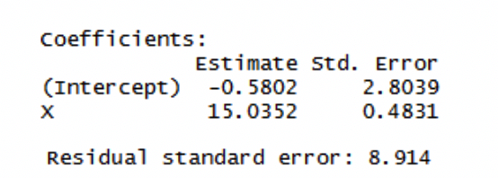

```{r setup, include=FALSE}
knitr::opts_chunk$set(echo = TRUE)
```

1. A member of a student team playing an interactive marketing game received the following computer output when studying the relation between advertising expenditures ($X$) and sales ($Y$) for one of the team's products: Estimated regression equation: $\hat{Y} = 350.7 - .18X$. Two-sided P-value for estimated slope: $0.91$. The student stated: "the message I get here is that the more we spend on advertising this product, the fewer units we sell!" Comment.

  **Solution**:
  
  The null hypothesis is $\beta_1 = 0$, P-value is $0.91$, which means we fail to reject the null hypothesis. We do not have enough evidence to assure the linear relationship between $X$ and $Y$, thus the statement is incorrect.
  
2. Refer to the problem 5 in the homework 1, use R to generate confidence band for

  a) mean value prediction,
  b) single value prediction,
  c) mean of 3 new values prediction,
  d) Working-hotelling confidence band. Comment on their difference.
  
  **Solution**:
  
  a) Mean value prediction is given as 
```{r, warning=FALSE}
airfreight_df <- read.csv('data/airfreight.csv', header = TRUE)
names(airfreight_df)
X <- airfreight_df$X
Y <- airfreight_df$Y
SSXY <- t(X - mean(X)) %*% (Y - mean(Y))
SSX <- t(X - mean(X)) %*% (X - mean(X))
slope <- SSXY / SSX
intercept <- mean(Y) - slope * mean(X)
Y_hat <- slope * X + intercept
Y_residual <- Y - Y_hat
SSE <- sum(Y_residual^2)
N <- length(X)
MSE <- SSE / (N - 2)
Xmean <- mean(X)
std_Y_hat <- rep(0,N)
CI_lbYhat <- rep(0,N)
CI_ubhat <- rep(0,N)
for (i in seq(N)){
  std_Y_hat[i] <- sqrt(MSE * (1 / N + (X[i] - Xmean)^2 / SSX))
  CI_lbYhat[i] <- Y_hat[i] - qt(1 - 0.01/2,N - 2) * std_Y_hat[i]
  CI_ubhat[i] <- Y_hat[i] + qt(1 - 0.01/2,N - 2) * std_Y_hat[i]
}
cat(paste('Mean value prediction at level (X =',X ,') confidence interval is\n 
          [', CI_lbYhat,',', CI_ubhat,'].\n'))

```
  b) Single value prediction is given as
```{r, warning=FALSE}
std_Y_hnew <- rep(0,N)
CI_lbYhnew <- rep(0,N)
CI_ubYhnew <- rep(0,N)
for (i2 in seq(N)){
  std_Y_hnew[i2] <- sqrt(MSE * (1 / N + (X[i2] - Xmean)^2 / SSX + 1))
  CI_lbYhnew[i2] <- Y_hat[i2] - qt(1 - 0.01 / 2, N - 2) * std_Y_hnew[i2]
  CI_ubYhnew[i2] <- Y_hat[i2] + qt(1 - 0.01 / 2, N - 2) * std_Y_hnew[i2]
}
cat(paste('Single value prediction at level (X =',X ,') confidence interval is\n 
          [', CI_lbYhnew,',', CI_ubYhnew,'].\n'))
```
  c) Mean of 3 new values prediction is given
```{r, warning=FALSE}
std_Ybar_hnew <- rep(0,N)
CI_lbYbarhnew <- rep(0,N)
CI_ubYbarhnew <- rep(0,N)
for (i3 in seq(N)){
  std_Ybar_hnew[i3] <- sqrt(MSE * (1 / N + (X[i3] - Xmean)^2 / SSX + 1 / 3))
  CI_lbYbarhnew[i3] <- Y_hat[i3] - qt(1 - 0.01 / 2, N - 2) * std_Ybar_hnew[i3]
  CI_ubYbarhnew[i3] <- Y_hat[i3] + qt(1 - 0.01 / 2, N - 2) * std_Ybar_hnew[i3]
}
cat(paste('Single value prediction at level (X =',X ,') confidence interval is\n 
          [', CI_lbYbarhnew,',', CI_ubYbarhnew,'].\n'))
```
  d) Working-hoteling confidence band is given as
```{r, warning=FALSE}
std_Y_hat <- rep(0,N)
CB_whlb <- rep(0,N)
CB_whub <- rep(0,N)
W <- sqrt(2 * qf(1 - 0.01, 2, N - 2))
for (i4 in seq(N)){
  std_Y_hat[i4] <- sqrt(MSE * (1 / N + (X[i4] - Xmean)^2 / SSX))
  CB_whlb[i4] <- Y_hat[i4] - W * std_Y_hat[i4]
  CB_whub[i4] <- Y_hat[i4] + W * std_Y_hat[i4]
}
cat(paste('Working hotelling band at level (X =',X ,') confidence interval is\n 
          [', CB_whlb,',', CB_whub,'].\n'))
```
```{r, warning=FALSE}
plot(X,Y)
abline(a=intercept,b=slope,color='blue')
lines(X[order(X)], CI_lbYhat[order(X)],col="red", lwd=2, lty=3)
lines(X[order(X)], CI_ubhat[order(X)], col="red", lwd=2, lty=3)

lines(X[order(X)], CI_lbYhnew[order(X)],col="green", lwd=2, lty=3)
lines(X[order(X)], CI_ubYhnew[order(X)], col="green", lwd=2, lty=3)

lines(X[order(X)], CB_whlb[order(X)],col="yellow", lwd=2, lty=3)
lines(X[order(X)], CB_whub[order(X)], col="yellow", lwd=2, lty=3)

legend(2, 12, legend=c("fitted curve", "Mean value", "Single value", "Working-hotelling"),
       col=c("black", "red", "green", "yellow"), lty=c(1,2,2,2), cex=0.8)
```
  It is revealed that the the working hotelling confidence band is a little wider than Mean value confidence band at any level of $X$. The prediction intervals for all levels of $X$ will form a band with the largest width. 
  
3. Tri-City office Equipment Corporation sells an imported copier on franchise basis and performs preventive maintainance and repair service on this copier. Data have been collected from $45$ recent calls on users to perform routine preventive maintainance service; for each call, $X$ is the numnber of copiers serviced and $Y$ is the total number of minutes spent by the service person. Assume that simple linear regression model is appropriate. The following shows partial result.


  a) Estimate the change in the mean service time when the number of copiers serviced increases by one. Use a $90$ percent confidence interval. interpret your confidence interval.
  b) Conduct a test to determine whether or not there is a linear association between $X$ and $Y$ here (i.e., $\beta_1 \neq 0$); At a significant level of $0.05$, state the hypothesis, reject region, estimate the p value, and state the conclusion of your test.
  c) The manufacturer has suggested that the mean required time should not increase by more $14$ minutes for each additional copier that is serviced on a service call. Conduct a test to test whether this standard is being satified by Tri-City. At a significant level of $.05$. State the hypothesis, reject region, estimate the p value, and state the conclusion of your test.
  d) Dose $b_0$ give any relevant information here about the "start-up" time on calls--i.e. about time required before service work is begun on the copiers at a customer location?
  e) In order to perform the following hypothesis test ($\alpha = 0.05$),
  $$H_0: \beta_1 = 0,\quad H_a: \beta_1 \neq 0$$
  complete the following ANOVA table for the data. According to the F value and degree of freedom, use F tale to estimate the P-value of the test.
  
| Source | degree of freedom | Sum of Squares | Mean Square | F-value |
|:------:|:-----------------:|:--------------:|:-----------:|:-------:|
|Model   |        $1$        |   $76960$      |    $76960$  | $968.78$| 
|Error   |         $43$      |   $3416$       |    $79.44$  |         |
|Corrected Total|  $44$      |   $80376$      |             |         |

 
  
  f) Compare the F test statistic obtained here and demonstrate numerically its equivalence to the T test statisc in b).

  **Solution**:
  
  a) The change in the mean service time when the number of copiers serviced increased by 1 is $15.0352$. The estimated standard deviation for $b_1$ is $0.4831$.
```{r, warning=FALSE}
cat(paste('The 90% confidence interval for b1 is\n
          [',15.0352 - qt(1 - 0.1/2, 45-2) * 0.4831, ',',
          15.0352 + qt(1 - 0.1/2, 45-2) * 0.4831, '].'))
```
We are $90\%$ certain that the true slope $\beta_1$ will fall into this confidence interval.

  b) The hypothesis test is stated as 
  $$H_0: \beta_1 = 0 \quad H_a: \beta_1 \neq 0$$
  Test statistic is given as $Ts = \frac{b_1 - 0}{s_{b_1}} = \frac{15.0352}{0.4831} = 31.1232$. We will reject the null hypothesis if $|t|>2.0167$ or if $\text{p-value} < 0.05$. The p-value is given by $\text{p-value} = 2\times P(t>Ts) \approx 0 < 0.05$. It is concluded that the null hypothesis that the linear association between $X$ and $Y$ does not exist can be rejected with high significance level of confidence.
  
  c) The hypothesis test is given by
  $$H_0: \beta_1 \leq 14 \quad H_a: \beta_1 > 14$$
  Test statistic is given as $Ts = \frac{b_1 - 14}{s_{b_1}} = \frac{1.0352}{0.4831} = 2.1428$. We will reject the null hypothesis if $t > 1.681$ or if $\text{p-value} < 0.05$. The p-value is given by $\text{p-value} = P(t > Ts) = 0.0189 < 0.05$. It means the null hypothesis can be rejected with sufficient evidence. The statement is hard to be achieved.

  d) The intercept does not give relevant information on the "start-up" time on calls. Construct a hypothesis test $H_0: \beta_0 = 0$, but it can not be rejected with high confidence since $\text{p-value} = 0.84$.
  
  e) F value is computed using R
```{r, warning=FALSE}
968.78 > qf(1-0.05,1,43)
p.value <- 1 - pf(968.78,1,43)
print(paste('P-value is ', p.value))
```
  We reject the null hypothesis with the analysis of the variance.
  
  f) Compare F test to the T test in b).
  $$SSR = \sum_{i = 1}^N(\hat{Y}_i - \bar{Y}) = b_1^2\sum_{i = 1}^N(X_i - \bar{X})^2$$
  Then, we have
  $$F^\ast = \frac{MSR}{MSE} = \frac{b_1^2\sum_{i = 1}^N(X_i - \bar{X})^2}{MSE} = (\frac{b_1}{s_{b_1}})^2 = (t^\ast)^2$$
  The derivation implies the equivalence of the F test to the T test. Correspondingly, it can be verified numerically that 
  $$F^\ast = 968.78 \approx 31.1232^2 = T_s^2$$
  $$(t(1-\alpha/2;N-2))^2 = F(1-\alpha;1,N-2) = 2.0167^2 = 4.0670$$

4. Refer to the problem 2 in homework 1.

  a) Complete the ANOVA table for the hypothesis test. 
  $$H_0: \text{ACT and GPA score are associated}\quad H_a: \text{ACT and GPA score are not associated}$$
  Or equivalently, 
  $$H_0: \beta_1 = 0 \quad H_a: \beta_1 \neq 0$$
  Estimate the p value and state the conclusion.
  
| Source | degree of freedom | Sum of Squares | Mean Square | F-value |
|:------:|:-----------------:|:--------------:|:-----------:|:-------:|
| Model  |         $1$       |  $0.009976081$ |$0.009976081$|$0.1887$ |
| Error  |         $8$       |  $0.4228315$   |$0.05285394$ |         |
| Corrected Total |   $9$    |  $0.4328076$   |             |         |
  
  b) What is $R^2$? Perform a hypothesis test on the correlation, compute the test statistic and estimate p value, then state the conclusion. Use significant level of $0.05$.
  $$H_0: \rho = 0, \quad H_a: \rho \neq 0$$
  c) Compare 4a) to 3e), which model seems to be a better fit? Discuss the models based on MSE and $R^2$?
  
  d) The GPA data used in this problem is actually the first $10$ cases of a larger data set, and has a very small $R^2$, is it possible that for the complete set $n > 10$, $R^2$ will be zero? Could $R^2$ not be zero for the first $10$ cases, yet equal to zero for all $30$ cases? If applicable, sketch two scatter plots to demonstrate the two situations.
  
  e) Use R to compute a $95\%$ CI for the population coefficient.
  
  **Solution**:
  
  a) P-value is given by
  $$\text{p-value} = P(F > F^\ast;1,8) = 0.394 > 0.05$$
  Thus we fail to reject the null hypothesis.
  
  b)  
  
  
  
  
  
  
  
  
  
5. Use R to complete this problem. Experience with a certain type of plastic indicates that a relation exists between the hardness (measured in Brinell units) of items molded from the plastic, and the elapsed time since termination of the molding process. Sixteen batches of the plastic were made, and one test item was molded from each batch. Each test item was randomly assigned to one of four predetermined time levels ($X = 16, 24, 32, \text{or} 40$ hours), and the hardness ($Y$) was measured after the assigned elapsed. Data is in plastic.csv

  a) Obtain the estimated simple linear regression model (SLR or SLM). Plot the estimated regression function and the data. Does a linear regression function appear to be a good fit?
  b) Plot the residuals against the fitted values to ascertain whether any departures from regression model are evident. State your findings.
  c) Plot a normal probability plot of the residuals. Perform a Shapiro-Wilk normality test on the residuals. Does the normality assumption appear to be reasonable here?
  d) Use the Brown-Forsythe test to determine whether or not the error variance varies with the level of $X$. Divide the data into two groups, $X \leq 24$, $X > 24$, use $\alpha = 0.05$. Does your conclusion support your preliminary findings in part b)?
  
  
  
  
  
  
  
  
  
  
  
  
  
  
  
  
  
  
  
  
  
  
  
  
  
  
  
  
  
  
  
  
  
  
  
  
  
  
  
