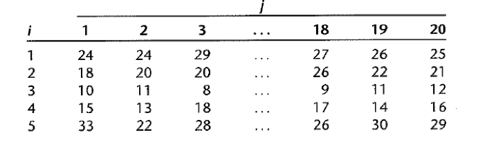
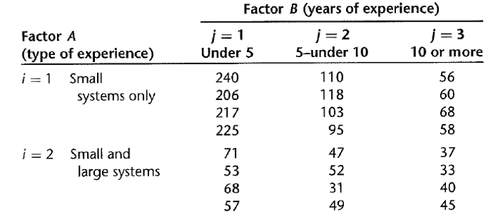

```{r setup, include=FALSE}
knitr::opts_chunk$set(echo = TRUE)
```

1. A soft drink manufacturer uses five agents to handle premium distributions for its various products. The marketing director desired to study the timeliness with which the premiums are distributed. Twenty transactions for each agent were selected at random, and the time lapse (in days) for handling each transaction was determined. The results are in premium.txt.


a) Use aligned box plots to compare the factor level means. Do they appear to be different? Does the variability of the observations within each factor level appear to be approximately the same for all factor levels?

b) Obtain the fitted values.

c) Obtain the residues. Do they sum to zero as in the regression model?

d) Obtain the analysis of variance table.

e) Test whether or not the mean time lapse differs for the five agents; use $\alpha = 0.1$. State the alternatives, decision rule, and conclusion.

f) Test assumption for the test.

**Solution:**

a)
```{r, warning=FALSE}
premium <- read.table('premium.txt', header = FALSE)
library('ggpubr')
ggboxplot(premium,x='V2', y='V1')
```
The aligned box plots seem to be different. The variability of the observations within each factor level does not appear to be approximately the same.

b)
```{r, warning=FALSE}
premium$design <- as.factor(premium$V2)
premium$y <- premium$V1
premium$x1 <- c(rep(1,20),rep(0,60),rep(-1,20))
premium$x2 <- c(rep(0,20),rep(1,20),rep(0,40),rep(-1,20))
premium$x3 <- c(rep(0,40),rep(1,20),rep(0,20),rep(-1,20))
premium$x4 <- c(rep(0,60),rep(1,20),rep(-1,20))

premium.mod <- lm(y~x1+x2+x3+x4,premium)
summary(premium.mod)
#summary(lm(y~design, premium))
```
Above code implies $\mu_1 = 24.55, \mu_2 = 22.55, \mu_3 = 11.75, \mu_4 = 14.8$ and $\mu_5 = 30.1$. The population mean is $\mu_{.} = 20.75$

c) The residues are given below. They do sum to zero.
```{r, warning=FALSE}
res <- premium$y - c(rep(24.55,20),rep(22.55,20),rep(11.75,20),rep(14.8,20),rep(30.1,20))
res
sum(res)
```

d) The ANOVA table is given by
```{r, warning=FALSE}
anova(premium.mod)
```

e) The test is stated as
$$H_0: \tau_1 = \tau_2=\dots=\tau_5 = 0;\quad H_a: \text{at least one } \tau_i \text{ is nonzero} $$
Based on F test, the test statistic is $Ts = \frac{MSR(X_1,X_2,X_3,X_4)}{MSE} = \frac{1107.5225}{7.52} = 147.28 > 2.004$. The null hypothesis is rejected, the mean time differs.
```{r,warning=FALSE}
qf(1-0.1,4,95)
```
f) The test assumption is that the error is assumed to be normally distributed with constant variance.

2. Refer to problem 1, suppose that 25 percent of all premium distribution are handled by agent 1, 20 percent by agent 2, 20 percent by agent 3, 20 percent by agent 4, and 15 percent by agent 5.

a) Obtain a point estimate of the grand mean $\mu$. When the ANOVA model is expressed in the factor effects with the weights being the proportions of premium distribution handled by each agent.
$$\mu. = \sum w_i\mu_i$$
b) Test whether or not the mean lapse differs for the five agents; use = 0.1. State the alternatives, decision rule, and conclusion.

**Solution:**

a) The estimate of the grand mean is given by
$$\begin{aligned}
\hat{\mu}_{.} &= 0.2\hat{Y}_1 + 0.2\hat{Y}_2 + 0.3\hat{Y_3} + 0.2\hat{Y}_4 + 0.15\hat{Y}_5 \\
& = 0.2\times 24.55 + 0.2\times 22.55 + 0.2\times 11.75 + 0.2\times 14.8 + 0.15\times 30.1 \\
& = 19.245
\end{aligned}$$
```{r,warning=FALSE}
premium$x11 <- c(rep(1,20),rep(0,60),rep(-4/3,20))
premium$x22 <- c(rep(0,20),rep(1,20),rep(0,40),rep(-4/3,20))
premium$x33 <- c(rep(0,40),rep(1,20),rep(0,20),rep(-4/3,20))
premium$x44 <- c(rep(0,60),rep(1,20),rep(-4/3,20))

premium.mod1 <- lm(y~x11+x22+x33+x44,premium)
summary(premium.mod1)
```

b)
The test is stated as
$$H_0: \tau_1 = \tau_2=\dots=\tau_5 = 0;\quad H_a: \text{at least one } \tau_i \text{ is nonzero} $$
Based on F test, the test statistic is $Ts = \frac{MSR(X_1,X_2,X_3,X_4)}{MSE} = \frac{1107.525}{7.52} = 147.28 > 2.004$. The null hypothesis is rejected, the mean time differs.
```{r,warning=FALSE}
anova(premium.mod1)
qf(1-0.1,4,95)
```


3. Refer to problem 1.

a) Construct a $90\%$ confidence interval for the mean time lapse for agent 1.

b) Obtain a $90\%$ confidence interval for $\mu_2 - \mu_1$. Interpret your interval estimate.

c) The marketing director wishes to compare the mean time lapses for agents 1, 3, and 5. Obtain confidence interval for all pairwise comparisons among these three treatment means; use the Bonferroni procedure with a $90\%$ family level.

**Solution:**

a) the confidnece interval of mean for agent 1 is $[23.53128,\;25.56872]$.
```{r, warning=FALSE, echo=FALSE}
library(ALSM)
oneway(premium$y,premium$design,alpha = 0.1, mc=matrix(c(1,0,0,0,0),1,5))$Contrast.NOT.simultaneous
```
b) The confidence interval is $[-3.4406818,\;-0.5593182]$. A contrast between factor level mean $\mu_1$ and $\mu_2$ lies in this interval with probability 0.9.

```{r, warning=FALSE}
oneway(premium$y,premium$design,alpha=0.1, mc=matrix(c(-1,1,0,0,0),1,5))$Contrast.NOT.simultaneous
```

c) For pairwise comparisons, we know $s^2\{L\} = MSE\cdot \frac{1}{10} = 0.752$ and $B = t(1-\frac{\alpha}{2g};n_T-r) = 2.159448$. The simultaneous CI is computed with $\hat{L} \pm Bs\{L\}$.
```{r}
qt(1-0.1/2/3,95)
```
4. Refer to problem 1, suppose primary interest is in estimating the following comparisons:
$$L_1 = \frac{\mu_1 + \mu_2}{2} - \mu_5$$
$$L_2 = \frac{\mu_1 + \mu_2}{2} - \frac{(\mu_3 + \mu_4)}{2}$$

a)Obtain a $90\%$ confidence interval for individual comparision.

b) Obtain a $90\%$ simultaneous confidence interval for the two comparisons.

**Solution:**

a) 
$$\hat{L}_1 = \frac{24.55+22.55}{2} - 30.1 = -6.55$$
$$\hat{L}_2 = \frac{24.55+22.55}{2} - \frac{11.75+14.8}{2} = 10.275$$
$$s^2\{L_1\} = MSE\cdot \frac{1.5}{20} = 0.564\quad s^2\{L_2\} = MSE\cdot \frac{1}{20} = 0.376$$
$$\text{qt}(1-\alpha/2;n_T-r) = 1.661052$$
```{r, warning=FALSE}
qt(1-0.1/2,95)
qt(1-0.1/2/2,95)
```
The CI for individual comparison is given by $\hat{L}_1 \pm s\{L_1\}1.661052 = [-7.797,\;-5.303]$ and $\hat{L}_2 \pm s\{L_2\}1.661052 = [9.256,\;11.294]$.

b) The Bonferroni simultaneous confidence interval
$$B = qt(1-\alpha/2g;n_T-r) = 1.985251$$
The CI is given by $\hat{L}_1 \pm s\{L_1\}1.985251 = [-8.041,\;-5.059]$ and $\hat{L}_2 \pm s\{L_2\}1.985251 = [9.058,\;11.492]$.

5. A computer software firm was encountering difficulties in forcasting the programmer requirements for large-O scale programming projects. Twenty-four programmers are classified into equal groups by type of experience (factor A) and amount of experience (factor B) were asked to predict the number of programmer days required to complete a large project about to be initiated. After this project was completed, the prediction errors (actual minus predicted programmer-days) were determined. The data is in programmer.txt


a) Prepare an estimated means plot. Does your graph suggest that any main factor or interaction effects are present? Explain.

b) Obtain the ANOVA table. Does any one source account for most of the total variability?

c) Test whether the two factors interact; use 0.01 significant level.

d) Test whether the main effects are present, use 0.01 significant level.

**Solution:**

a)
```{r, warning=FALSE}
programmer <- read.table('programmer.txt', header = FALSE, col.names = c('y','A','B','ord'), colClasses = c('numeric','factor','factor','numeric'))
summary(programmer)
```
```{r}
prog.mod <- lm(y~A*B,programmer)
summary(prog.mod)

prog.stat <- model.tables(aov(y~A*B,data=programmer), type="means",se=T)
A.means <- prog.stat$tables$A
B.means <- prog.stat$tables$B
plot(A.means,xaxt='n')
plot(B.means,xaxt='n')
cell.means <- prog.stat$tables$`A:B`; cell.means
```
From the estimated means plots, the interaction effects is significant.

b)
```{r}
summary(aov(prog.mod))
```
From ANOVA table, we know type of experience accounts for most of the total variability.

c)
$$H_0: \text{all } (\alpha\beta)_{ij} \text{ equal zero}, H_a: \text{not all } (\alpha\beta)_{ij} \text{ equal zero.}$$
The test statistic is given by $Fs = 10, 083/86 = 117.07$, since $F(0.99;2,18) = 6.01 < Fs$. $H_0$ is rejected.

d)
For A:
$$H_0: \alpha_1 = \alpha_2 = 0,\quad H_a: \text{not both } \alpha_1 \text{ and } \alpha_2 \text{ equal zero.} $$
The test statistic is given by $Fs = 39447/86 = 458.02$, since $F(.99;1,18) = 8.29$, which is less than $Fs$, so $H_0$ is rejected.
For B:
$$H_0: \text{all } \beta_j \text{ equal zero } (j = 1, 2, 3),\quad H_a: \text{ not all } \beta_j \text{ equal zero.}$$ Since $Fs = 18206/86 = 211.39 > F(0.99;2,18) = 6.01$. $H_0$ is rejected.

6.Refer to question 5.

a) Estimate $\mu_{23}$ with 99 percent confidence interval. Interpret your estimate.

b) Estimate $D = \mu_{12} - \mu_{13}$ with $99\%$ confidence interval. Interpret your estimate.

c) The nature of the interaction effects is to be studied by comparing the effects of type of experience for each yours-of-experience group. Specifically, the following comparisons are to be estimated:
$$L_1 = (\mu_{11} - \mu_{21}) - (\mu_{12} - \mu_{22})$$
$$L_2 = (\mu_{11} - \mu_{21}) - (\mu_{13} - \mu_{23})$$
$$L_3 = (\mu_{12} - \mu_{22}) - (\mu_{13} - \mu_{23})$$
Obtain a simultaneous confidence interval, with $95\%$ level.

d) To examine whether a transformation of the data would make the interaction unimportant, plot separately the transformed estimated means for the reciprocal (1/Y) and logarithmic transformation ($\log Y$). Would either of these transformations have made the interaction effects unimportant?


