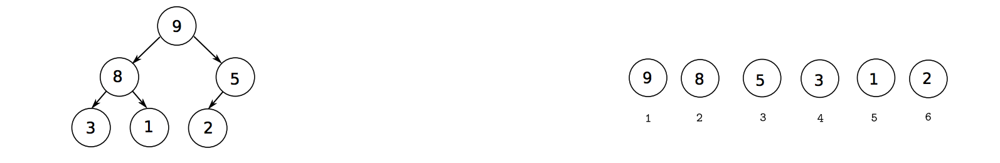

```{r setup, include=FALSE}
knitr::opts_chunk$set(echo = TRUE)
```

**Problem 1: Eigenvalues and eigenvectors.**

  1. Explain why the power method returns the largest eigenvalue and its eigenvector.
  2. Explain why the condition number of a symmetric matrix is the ratio of its largest and smallest eigenvalues.
  
  **Solution:**
  
  1. Suppose $A$ is a $n\times n$ matrix with a dominant eigenvalue, i.e., the eigenvalues of $A$ should satisfy $|\lambda_1| > |\lambda_2| \ge |\lambda_3|\ge \cdots \ge |\lambda_n|$ and the associated eigenvectors are given as $v_1, v_2, \cdots, v_n$. Even though n eigenvectors may not be linearly independent, it is still available to express any vector as a linear combination of the eigenvectors, that is 
  $$q^{(0)} = a_1 v_1 + a_2 v_2 + \cdots + a_n v_n$$
Repeatedly multiplying both sides by $A$ many times gives
  $$A^k q^{(0)} = \lambda_1^k\left(a_1 v_1 + a_2 (\frac{\lambda_2}{\lambda_1})^k v_2 + \cdots + a_n (\frac{\lambda_n}{\lambda_1})^k v_n\right)$$
Since $|\lambda_1|$ is the eigenvalue with the largest magnitude, it means $\left(\frac{\lambda_i}{\lambda_1}\right)^k \to 0$ as $k \to \infty$. If $k$ is large enough, it is concluded that the result will converge to the dominant eigenvector, i.e., $\lambda_1^k a_1 v_1$. And the associated eigenvalue can be solved accordingly.

  2. The condition number of a matrix $A$ is defined by
  $$\kappa = \|A\|\cdot \|A^{-1}\|$$
  Since $A$ is a symmetric matrix, it is diagonalizable by $A = Q^T \Lambda Q$, where $Q$ is an orthogonal matrix. Therefore,
$$\begin{aligned}
\|A\| & = \sup_{\|x\| = 1}\sqrt{\|Ax\|^2} = \sup_{\|x\| = 1}\sqrt{x^T A^T A x} \\
      & = \sup_{\|x\| = 1}\sqrt{x^T Q^T \Lambda^2 Q x} = \sup_{\|y\| = 1}\sqrt{y^T \Lambda^2 y} \\
      & = \sup_{\|y\| = 1}\sqrt{\sum_{i=1}^n \lambda_i^2 y_i^2} \leq \sqrt{\max_i \lambda_i^2} = \max_i |\lambda_i|
\end{aligned}$$
Similarly, we also have 
$$\|A^{-1}\| = \max_i |\frac{1}{\lambda_i}| = \frac{1}{\min_i |\lambda_i|}$$
This gives the proof that 
$$\kappa = \|A\|\cdot \|A^{-1}\| = \frac{\max_i |\lambda_i|}{\min_j |\lambda_j|}$$

**Problem 2: Implementing priority queues and sorting.**

We will implement a priority queue with maximum capacity $\rm{LMAX}$. While there's no need to limit the size of the queue, we will do this for simplicity, so that we can pre-allocate memory (increasing the length of a vector in $\rm{R}$ by $1$ is an $\it{O(n)}$ operation: http://musicallyut.blogspot.com/2012/07/pre-allocate-your-vectors.html) We will organize a heap as a vector, organizing its elements sequentially as in the right subfigure below.

  
  3. What is the index of the parent node of element $i$ of the vector? What are the indices of the left and right child nodes of element $i$ of the vector?
  4. Write a function $\rm{make\_heap}$ to return an empty heap.
  5. Write a function to return the maximum element of the heap.
  6. Write a function to remove the maximum element of the heap.
  7. Write a function to insert a new element into the heap. For the last two, you can create additional helper functions if you want to.
  8. Finally, write a function to sort a vector of number of numbers using the heap above. The function should first sequentially add elements to the queue, and then sequentially remove the maximum element. Demonstrate that these work on an example with $20$ random numbers.

  **Solution:**
  
  3. The index of the parent node of element $i$ of the vector is $\lfloor i/2 \rfloor$. The index of the left child node of the $i-th$ node is $2i$, the right child node is $2i + 1$. 
  4. The function to return an empty heap is given as follows
```{r,warning=FALSE}
make_heap <- function(){
  LMAX <- 20 # maximum capacity of the priority queue
  vector.heap <- rep(NA, LMAX)
  return(list(vector.heap=vector.heap, length.heap=0)) # return the heap vector and its length
}
```
  5. The function to return the max of heap is given by
```{r,warning=FALSE}
getMax.heap <- function(heap){
  maximum <- heap$vector.heap[[1]]
  return(maximum)
}
```
  6. The function to remove the maximum of the heap is given by
```{r,warning=FALSE}
# define a helper function to swap elements in heap
swapElements.heap <- function(heap, position1, position2){
  tmp <- heap$vector.heap[[position1]]
  heap$vector.heap[[position1]] <- heap$vector.heap[[position2]]
  heap$vector.heap[[position2]] <- tmp
  return(heap)
}
# downward heapification
downwardHeapify <- function(heap){
  if (heap$length <= 1) return(heap)
  rootID <- 1
  while(rootID * 2 <= heap$length){
    leftID <- rootID * 2
    rightID <- rootID * 2 + 1
    id_swap <- leftID
    if (rightID <= heap$length && heap$vector.heap[[leftID]] < heap$vector.heap[[rightID]]){
      id_swap <- rightID
    }
    if (heap$vector.heap[[id_swap]] <= heap$vector.heap[[rootID]]){
      break
    }
    else {
      heap <- swapElements.heap(heap,id_swap,rootID)
      rootID <- id_swap
    }
  }
  return(heap)
}
# define function to remove the max
removeMax.heap <- function(heap){
  heap$vector.heap[[1]] <- heap$vector.heap[[heap$length]]
  heap$vector.heap[[heap$length]] <- NA
  heap$length <- heap$length - 1
  heap <- downwardHeapify(heap)
  return(heap)
}
```
  7. Function to insert a new element into a heap is given below
```{r,warning=FALSE}
# upward heapification
upwardHeapify <- function(heap){
  if (heap$length <= 1) return(heap)
  chID <- heap$length
  while (chID > 1) {
    parentID <- floor(chID / 2)
    if (heap$vector.heap[[parentID]] >= heap$vector.heap[[chID]]){
      break
    }
    else{
      heap <- swapElements.heap(heap,chID,parentID)
      chID <- parentID
    }
  }
  return(heap)
}
# function to insert a new element
insert.heap <- function(element,heap){
  heap$vector.heap[[heap$length + 1]] <- element
  heap$length <- heap$length + 1
  return(upwardHeapify(heap))
}
```
  8. Implement the heap sort
```{r,warning=FALSE}
heapSort <- function(vectorToSort){
  heap <- make_heap()
  cat(paste('The vector needs to be sorted is:\n'))
  cat(paste(vectorToSort))
  for (elem in vectorToSort){
    heap <- insert.heap(elem,heap)
  }
  cat(paste('\nThe heapified vector is:\n'))
  cat(paste(heap$vector.heap))
  cat(paste('\nStart removing the max:'))
  for (id in 1:heap$length){
    maxHeap <- getMax.heap(heap)
    heap <- removeMax.heap(heap)
    cat(paste('\nThe maximal value removed is:',maxHeap))
    cat(paste('\nThe remaining heap is:'))
    print(heap$vector.heap)
  }
}

# generate a random vector with length 20
set.seed(155)
vec <- floor(rnorm(20,50,20))
heapSort(vec)
```

**Problem 3: The knapsack problem.**

Here we will implement the unbounded knapsack problem (unbounded refers to the fact we have an infinite number of objects of each type).

  1. Write a function that accepts as input two vectors of the same length, $\rm{w}$ and $\rm{v}$, the $i$th elements of which give the weight and value of the $i$th object. The function also accepts a scalar $\rm{W\_knapsack}$ giving the capacity of the knapsack. The function should return two objects, a scalar $\rm{V\_knapsack}$, giving the maximum value of the knapsack, and a vector $\rm{obj\_count}$, the $i$th element of which gives the number of objects of type $i$ contained in the bag when it is filled optimally.
  2. Test your function for the case $\rm{w} = (1,2,3,4,5,6), \rm{v} = (1,8,10,10,19,25)$ and $\rm{W} = 25$.
  
  **Solution:**
  
  1. The knapsack function is given as follows
```{r,warning=FALSE}
knapsack <- function(w, v, W_knapsack){
  n <- length(w) # number of objects
  value <- rep(0, W_knapsack+1) # define the total utility array V(W)
  pick <- rep(0, W_knapsack+1) # array to store the index of the object at wight W
  obj_count <- rep(0,n) # object count
  for (cur_w in seq(0,W_knapsack)){
    for (idx in seq(1,n)){
      if (w[idx] <= cur_w && value[cur_w + 1] < value[cur_w - w[idx] + 1] + v[idx]){
        value[cur_w + 1] <- value[cur_w - w[idx] + 1] + v[idx]
        pick[cur_w + 1] <- idx
      }
    }
  }
  
  w_reverse <- W_knapsack # index counts by reversing the process
  while (w_reverse > 0) {
    id <- pick[w_reverse + 1]
    obj_count[id] <- obj_count[id] + 1
    w_reverse <- w_reverse - w[id]
  }
  
  return(list(V_knapsack=value[W_knapsack + 1], obj_count=obj_count))
}
```
  2. The test is given as below
```{r,warning=FALSE}
w = c(1,2,3,4,5,6)
v = c(1,8,10,10,19,25)
W = 25
result <- knapsack(w,v,W)
print(result)
```

**Problem 4: Markov chains.**

Consider an $N$-state Markov chain. Call the state at time $t$ as $S_t$, which can take values from $1$ to $N$ (i.e., $S_t \in \{1,\dots , N\}$). The Markov chain has two parameters, an initial distribution over states $\pi^1$, and a transition matrix $A$. The former is an $N\times 1$ probability vector with $\pi_i^1 = P(S_1 = i)$. The latter is an $N\times N$ stochastic matrix (i.e., a matrix whose rows are nonnegative and sum to $1$). $A_{ij}$, the $(i,j)^{th}$ element of this matrix  gives the probability of moving from state $i$ to state $j$. Thus $P(S_{t+1} = j | S_t = i) = A_{ij}$. Write down as functions of $A$ and $\pi^1$:

  1. $P(S_2 = j, S_1 = i)$
  2. $P(S_2 = j)$
  
Let $\pi^t$ be an $N\times 1$ column-vector giving the probability over states at time $t$.

  3. Write $\pi^2$ as a function of $\pi^1$ and $A$. Use matrix notation (i.e., no summation).
  4. How many summations and multiplications does this involve? This gives the cost is big-$\rm{O}$ notation, write it down (i.e., is it $O(N),O(N^2),O(N^3),O(2^N)$ or what?).
  5. Write $\pi^t$ as a function of $\pi^1$ and $A$. Use matrix notation (Write $A^2$ for the multiplication of $A$ with itself, i.e., $A^2 = AA$. This notation is slightly ugly, since $A^t$ means multiplying $A$ with itself $t$ times, while $\pi^t$ means the probability vector at time $t$. This is OK, since it doesn't make sense to multiply a vector with itself). Write down the cost of calculating this quantity in big-$O$ notation (now it is a function of $N$ and $t$).
  
Consider a complete sequence of states $S = (S_1,S_2,\dots,S_{T-1},S_T)$.

  6. How many such sequences are there?
  7. Imagine we had a big table giving the probability of each sequence that is, someone has already calculated it for us. If for some time $t$ we wanted to calculate the probability $P(S_t = i)$ by brute force, we could marginalize out the other states:
  $$P(S_t = i) = \sum_{S \text{ such that } S_t = i} P(S)$$
How many summations does this approach require? If we wanted to calculate the entire $P(S_t)$, how many summations does this require.
  
  **Solution:**
  
  1. The probability is given as  
  $$P(S_2 = j , S_1 = i) = P(S_2 = j | S_1 = i)P(S_1 = i) = A_{ij}\pi_i^1$$
  
  2. The probability is given as
  $$P(S_2 = j) = \sum_{i = 1}^N P(S_2 = j, S_1 = i) = \sum_{i=1}^N A_{ij}\pi_i^1$$
  
  3. The formula is given as
  $$\pi^2 = A^T \pi^1$$
  
  4. $N^2$ multiplications and $N^2$ summations, the computational complexity is $O(N^2)$.
  5. The formula is given as
  $$\pi^t = \left(A^T\right)^{t-1}\pi^1 = \left(A^{t-1}\right)^T\pi^1$$
  The cost is $O(N^3log_2(t-1))$.
  6. Each $S_i$ has $N$ states, so there are $N^T$ types of sequences.
  7. $N^{T-1}$ summations required to calculate $P(S_t = i)$ since for the ohter $T-1$ elements in the sequence, each of which has $N$ different states need to be marginalized. If we want to calculate the entire vector $P(S_t)$, the total number of summation is $N^T$.
  
  
  
  
  
  
  
  
  
  


